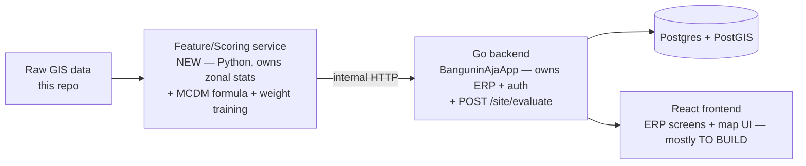

# PROJECT HANDOFF — BanguninAja

**Audit date:** 2026-09-21 · **Repos:** `BanguninAja` (this repo — data/GIS/docs) + `BanguninAjaApp` (separate repo — the actual ERP app, branch `feat/backend-auth`; `main` is an empty scaffold)

> Written to be handed to a teammate **and their own AI agent**. It states decisions and current state, not step-by-step instructions — the repo itself plus this doc should be enough for an agent to derive concrete tasks.

---

## TL;DR

- **Data**: 5 of 6 GIS layers are nationally complete and ready to use. The 6th (zoning/RDTR) is **abandoned as a national pull** — its only source has gone from "erroring" to "fully unreachable" over the past week and can't be relied on for a few-week deadline. Replaced with simulated/dummy regulation data (real data kept for the 11 cities already pulled) + a news-context card on the dashboard. See §3.
- **App**: lives in `BanguninAjaApp`, not here. Only `auth` (login/register/session) is fully built end to end. 12 of 13 backend domains (project, finance, sales, scoring, location, etc.) exist only as DB schema — no service/controller/UI yet. Frontend has zero map/GIS code so far.
- **Scoring engine design — frozen this session** (§4): MCDM (weighted sum across 6 dimensions), but the **weights are ML-learned**, not hand-picked, using a corrected target that avoids the original design's bias. Full reasoning in §4.
- **Architecture doc says FastAPI, code says Go** — code is ground truth; add a small Python service only for GIS/scoring math, don't rewrite the Go backend.
- **Biggest open item**: real deadline date (not in the repo) — §9.

---

## 1. Current State

**ERP app** (`BanguninAjaApp`, Go/Gin/GORM + React/Vite/Tailwind):
- Working: register, login, logout, session-refresh, one protected endpoint (`GET /auth/me`), all wired frontend-to-database.
- Not built: everything else. 12 backend domain slices (asset, billing, finance, hr, inventory, location, master, procurement, project, reporting, sales, scoring) have entities + DB constraints/indexes defined, zero HTTP layer. Frontend dashboard is a placeholder card; no map library installed at all.
- The `auth` slice (`backend/internal/auth/*.go`) is the reference pattern every new slice should copy: entity → repository → service → dto → controller → module, wired in `cmd/api/main.go`.

**Data** (`BanguninAja`, this repo): see §3.

**Docs vs. reality**: `docs/architecture/arsitektur-sistem.md` still says FastAPI/Next.js — stale, the team pivoted to Go/React without updating it. Its higher-level reasoning (modular monolith, API-first, two-layer data: coarse precompute + on-demand fine grid) is still sound and should be kept; only the stack section is wrong.

---

## 2. Six-Layer Data Status

| Layer | Status | Notes |
|---|---|---|
| 1. Fisik & Lingkungan | ✅ National | 12 InaRISK hazard layers, DEM, soil, hydrology, faults. Solid. |
| 2. Regulasi & Zonasi | 🟡 **Real data for 11 cities only; simulated elsewhere, by decision** | Admin boundaries/forest/land-office all ✅. Zoning/RDTR/KDB-KLB: source is effectively dead (see §3) — not pursued further. Excluded from the score formula entirely, shown as descriptive-only info (§4b). |
| 3. Infrastruktur & Aksesibilitas | ✅ National | Roads/rail, health-facility accessibility. |
| 4. Demografi & Sosial | ✅ National (with 1 known gap) | WorldPop, BPS. Kecamatan-level crime confirmed unobtainable — stop chasing it, province-level is the finest available. |
| 5. Pasar & Kompetisi | ✅ National, **needs re-processing** | POI (72K points) pulled but is raw OSM tags, not categorized by building profile yet — see §4. |
| 6. Finansial Proyek | ✅ National | ZNT land value (filter the known int32-overflow sentinel value before use), IKK construction cost index. |

Minor accepted partials, not worth more effort: DEMNAS 8m elevation (10 cities, by design), tanah wakaf (1 city).

## 3. Zoning (RDTR) — abandoned as a national data-collection target

- Only working source ever found: `gistaru.atrbpn.go.id/rdtrinteraktif/api/interactive/data` (undocumented endpoint). The official ArcGIS service is dead (404/token-wall); Satu Peta is policy-restricted to government officials. **No alternative exists**, and as of this session the one working source has degraded from "erroring" to "fully unreachable" (TCP connection timeout on the whole domain) over the past ~8 days with no sign of recovery. Not worth betting a few-week deadline on.
- **Decision**: stop pursuing the national bulk pull. Keep the **11 cities already pulled** (real data, `data/raw/rdtr/`) — use it where it happens to cover the demo. Everywhere else, use simulated/dummy regulation data (§4) instead of leaving the layer empty.
- `scripts/ambil_rdtr.py` stays in the repo as-is (don't delete — the circuit breaker and throttling are good engineering to keep as reference, and the source could come back). Just not on anyone's critical path anymore.

## 4. Scoring Engine Design — FROZEN

Two designs existed (Derick's CNN/deep-learning proposal vs. Jonathan's weighted-MCDM proposal); both were fully written up and left unresolved in the repo. **Resolved this session, confirmed by Derick — plus a further refinement once the RDTR source died (see below).**

### 4a. Predictive dashboard — the actual MCDM score

Covers only the **5 layers with solid real national data**: Fisik & Lingkungan, Infrastruktur & Aksesibilitas, Demografi & Sosial, Pasar & Kompetisi, Finansial Proyek. **Regulasi & Zonasi is deliberately excluded from the score formula entirely** — not given a small weight, not blended in at all. Reasoning: regulation is a hard yes/no constraint (legal to build or not), and a weighted-average model would let a great market/demographic score "compensate" for an illegal site, which is exactly wrong. Constraints don't average.

- `score = Σ dimension_value × weight` over those 5 dimensions, per building profile.
- **Weights are ML-learned**, not hand-picked: train a simple interpretable regression (linear/small tree — not deep learning) per building profile, predicting an "unserved demand" target — `population_in_radius / (count_of_same_profile_facilities_in_radius + 1)` — from the 5 normalized dimension scores. This replaces the original presence-only label design, which had a real structural flaw (it would've taught a model to recommend *more* clustering where things already are — the opposite of the product's stated problem). Coefficients/importances, normalized to sum 100%, become that profile's weights in `scoring.Weight`.
- Runtime stays a plain weighted sum; the ML only runs offline/periodically to produce the weights.
- New small task this creates: categorize the existing POI dataset by building profile (currently raw OSM tags like `"shop"=>"mall"` in `other_tags`, not yet bucketed into housing/hospital/mall/entertainment) — needed for the target computation.

### 4b. Descriptive dashboard — regulasi + news, shown separately, never scored

A second panel next to the predictive score, not merged into it:
- **Regulasi**: real KDB/KLB/zoning text for the 11 already-pulled cities; a clearly-labeled **simulated** value everywhere else (grounded in what real data we do have everywhere — kawasan-hutan/land-use type from GADM — plus a plausible placeholder for KDB/KLB numbers, flagged in the API response so the UI can show "data simulasi" rather than passing it off as real).
- **News**: a handful of recent articles relevant to the site's region/kecamatan, fetched at request time, shown as qualitative context ("apa yang lagi terjadi di sekitar lokasi ini") — pure UI content, never touches the scoring formula or the weight training.

Full CNN/deep-learning-over-raster-patches is **cut**, not deferred — it solved a problem (per-point image context) this design doesn't need.

---

## 5. Architecture



Keep Go for everything already working (auth, ORM, HTTP, business slices). Add a small Python service only for GIS math and weight training — that's where all the existing scripting expertise already is; don't reimplement zonal statistics in Go.

---

## 6. Full Task List

Every task in the project, regardless of owner, with its real dependency. This is the master map — §7 just assigns names to these. `—` means no dependency, safe to start immediately.

| ID | Task | Depends on |
|---|---|---|
| T1 | Publish `/site/evaluate` + `/score` contract (§8) | — |
| T2 | Build feature/scoring service: zonal stats + MCDM formula (5 dimensions, predictive only) | — (can build against placeholder weights first) |
| T3 | Weight-training script (target computation + regression, §4a) | T5 |
| T4 | Go `location`+`scoring` slice → wire `POST /site/evaluate` | T1 |
| T5 | Categorize POI by building profile (parse `other_tags`) | — |
| T6 | Go `project` slice (full stack, copy `auth` pattern) | — |
| T7 | Go `finance` slice (full stack) | — |
| T8 | On-chain payment simulation (billing slice: QR request → buyer pays via own wallet on testnet → verify via block-explorer API) | — |
| T9 | Simulated regulasi data: grounded in real kawasan-hutan/land-use (✅ national) + plausible placeholder KDB/KLB values, clearly flagged `is_simulated` in the schema; real values kept for the 11 already-pulled RDTR cities | — |
| T10 | News-context fetch: a few recent articles for a site's region/kecamatan, on-request, descriptive-only (§4b) | — |
| T11 | Fix `siapkan_data.py` path bug | — |
| T12 | Add deprecation note to `bulk_kriminalitas.py` | — |
| T13 | ERP nav/layout shell — see spec below | — |
| T14 | Wire Overview + Financial tabs to real data | T6, T7 |
| T15 | Real dashboard KPIs — this IS the cross-project financial view for MVP, see note below | T6, T7 |
| T16 | MapLibre GL map UI shell | — (soft prereq for T17, see below) |
| T17 | Wire map UI to live scoring (predictive score panel) | T4, T16 |
| T18 | Wire descriptive panel (regulasi + news) next to the score, on the same site page | T9, T10 |

**Reorganized for zero cross-person blocking**: every dependency chain (T1→T4→T16→T17, T6/T7→T13→T14/T15, T9/T10→T18) is now assigned to a single owner end-to-end (§7) instead of split across people — nobody waits on anyone else's handoff.

**Cross-project finance gap, and why the Dashboard covers it for MVP**: the `Financial` tab in T14 is per-project only. The schema actually supports a company-wide view too — `finance.JournalEntry`/`JournalLine` (general ledger) is *not* tied to a `ProjectID`, unlike `Budget`/`CashTransaction` — so a real "Finance across all projects" page is a legitimate future page, not a schema gap. But building a full top-level Finance section (ledger drill-down, cross-project cashflow) doesn't fit a 6-day deadline. **For MVP, T15's dashboard KPIs must actually roll up real numbers** (aggregate budget/spent/variance summed across every project, not just a project count) — that's the cross-project view for now. A dedicated top-level `Finance` nav item with ledger drill-down is explicitly P2, deferred.

**T13 spec** — the app currently has almost no navigation to build on (just Login/Register/a placeholder Dashboard), so this is close to a blank slate, not a redesign:

```text
Dashboard (cross-project KPIs — T15)
└── Portfolio
     └── [a Development/Project] → ONE workspace per project, with TABS, not separate pages:
          ├── Overview           (progress %, phases — from the `project` slice)
          ├── Site Intelligence  (the map — Erick's vertical, lives inside this workspace)
          └── Financial          (budget vs actual — from the `finance` slice)
          [Sales / Procurement tabs exist in the schema, P2, not MVP — don't build yet]
```

Principle for every tab (don't build flat CRUD tables): **KPI row at the top, a chart, then the detailed table underneath.** E.g. the Financial tab = budget-used % + variance number, a spend-over-time chart, *then* the transaction list below it. This mirrors the schema's own foreign keys (`Budget.ProjectID`, `CashTransaction.ProjectID` — financials already belong to a project in the data model; the UI should say so, not present them as an unrelated global table).

---

## 7. Work Distribution (5 people)

Reorganized as **full verticals** (one person owns a feature end-to-end, spec to UI) instead of per-layer roles, specifically so no one is ever blocked waiting on someone else's handoff. Tradeoff, stated plainly: Jonathan and Erick each now need both Go and React for their vertical — broader scope per person, in exchange for zero cross-person waiting.

| Person | Owns (end-to-end, no external dependency) | Due |
|---|---|---|
| **Jonathan Andrew Saleh** | **ERP Core**: T13 (nav shell), T6+T7 (Go project+finance), T14+T15 (tabs + dashboard KPIs) | 2026-09-27 |
| **Erick** | **Site Intelligence scoring feature**: T1 (contract, from the already-frozen §4a design — do this first, same-day), T16 (map shell), T4 (Go scoring endpoint), T17 (wire live scoring into the map) | 2026-09-27 |
| **Moses** | **Scoring service pipeline**: T2 (zonal stats + MCDM formula), T3 (weight training), T5 (POI categorization — feeds T3, do this first) — one coherent Python track, plus T11+T12 (small script fixes) | 2026-09-27 |
| **Ian** | **Descriptive context**: T9+T10 (simulated regulasi + news fetch), T18 (wire into the site page himself) | 2026-09-27 |
| **Derick** (you) | **T8 — on-chain payment simulation**, last priority and fully independent — no one else touches it, does not block or get blocked by anything else in the project | 2026-09-27 (or later — lowest priority of everything in this doc) |

MVP scope: only **Overview + Site Intelligence + Financial** tabs. Sales/Procurement/HR/Inventory have schema ready but are explicitly P2 — real, useful, not required to prove the concept.

Don't touch: `auth/*` (Go, done), `LoginPage/RegisterPage/sessionStore/useAuth` (frontend, done), the RDTR script's throttling constants (tuned after a real incident).

---

## 8. Integration Contracts

```text
Moses → Erick (internal, not public):
POST /score
  in:  latitude, longitude, building_profile_code
  out: overall_score, dimension_scores[{dimension_code, value, explanation}], risk_flags

Erick → Frontend (Jonathan / Erick himself for the map page):
POST /api/site/evaluate  (auth required)
  in:  project_id?, latitude, longitude, building_profile_id, name
  out:
    predictive: { overall_score, dimension_scores[], risk_flags }   ← from Moses's /score, 5 layers only
    descriptive: { regulasi: {..., is_simulated: bool}, news: [...] }   ← Ian's T9/T10, never scored
    saved_location_id

Erick → Jonathan:
GET /api/projects/{id}/financial-summary
  out: budget_total, spent_total, variance_pct, cashflow_by_month[]
```

---

## 9. Open Questions — Needs Confirmation from Derick

- Jonathan, Erick, Moses, and Ian's buy-in on their broadened full-stack vertical scopes (§7) — none of these were self-selected, all assigned top-down this session.
- Whether Sales/Procurement/HR/Inventory get attempted at all — moot for the 2026-09-27 deadline (out of scope by necessity, see the MVP scope note in §7), but worth confirming as a permanent cut vs. "later."

Everything else in this doc (scoring design, stack correction, MVP scope, team roster, task dependencies, **deadline: 2026-09-27**) is already resolved/confirmed.

Everyone on the team is executing with their own Claude — treat the task list (§6) and contracts (§8) as what each person hands their agent, not as manual step-by-step instructions.

---

## 10. Timeline

| Date | Milestone |
|---|---|
| 2026-09-21 | This doc finalized, team syncs, everyone starts same day |
| 2026-09-22 | Erick publishes the T1 contract (do this first — it's what everyone else's mocks are built against) |
| 2026-09-24 | Mid-point check-in — everyone should have their backend/data pieces working standalone by now |
| 2026-09-26 | Integration — merge everyone's pieces, swap mocks for real calls |
| **2026-09-27** | **Everything due** — all 18 tasks, full integration, working golden-path demo |

---

## 11. Top Risks

| Risk | Mitigation |
|---|---|
| Simulated regulasi data gets mistaken for real, undermines demo credibility if someone asks | `is_simulated` flag in the API response, shown explicitly in the UI (§4b); real data used for the 11 cities already covered |
| Jonathan's and Erick's verticals each span Go + React — broader stack per person than a typical assignment | Each is a self-contained vertical (§7), so even if slower, no one else is blocked waiting on it |
| Python↔Go integration is new territory for the team | Contract (§8) agreed before either side starts; kept to plain JSON/HTTP |
