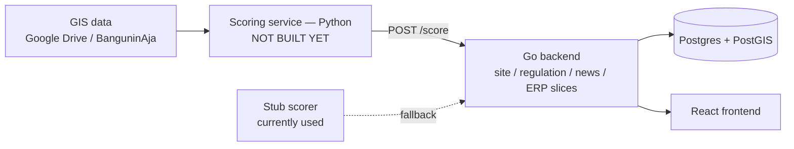

# PROJECT HANDOFF — BanguninAja

**Last updated:** 2026-10-02 · **Canonical copy:** this file, in `BanguninAjaApp`. The copy in the `BanguninAja` data repo is outdated — ignore it.

> Written to be handed to a teammate **and their own AI agent**. It states decisions and current state; the repo plus this doc should be enough for an agent to derive concrete tasks.

---

## TL;DR

- **The app runs end to end**: login → projects → financial → site evaluation (score + regulation + news) all work against the Go backend.
- **But the core feature is still fake.** `POST /api/site/evaluate` returns a **deterministic stub score** (hash of the coordinates, labelled "data simulasi") because the Python scoring service (`/score`) does not exist yet. Until it does, the "GIS-driven site intelligence" claim isn't true.
- **Nothing can be used on a fresh database** — there is no seed data, so the building-profile dropdown is empty and cash transactions can't be created.
- No map yet — locations are entered as raw latitude/longitude.

What's left is in §5.

---

## 1. Current State (verified against `main`, 2026-10-02)

### Backend (Go / Gin / GORM / PostGIS)
| Area | Status |
|---|---|
| Auth (register/login/refresh/logout/me) | ✅ Done |
| All 13 business slices — CRUD, services, tests (project, finance, location, scoring, master, sales, procurement, inventory, asset, hr, billing, reporting) | ✅ Done (Moses, `d44877b`) |
| `regulation` slice + `cmd/import-rdtr` | ✅ Done — real RDTR for imported cities, simulated (`is_simulated: true`) everywhere else |
| `news` slice | ✅ Done — Google News RSS by region |
| `site` slice → `POST /api/site/evaluate` | ✅ Done — returns predictive + descriptive in **one** response (see §3) |
| Real scoring (`/score`, Python) | ❌ **Not started** — `site` falls back to a stub |
| Seed data (accounts, units, regions, dimensions, building profiles, weights) | ❌ **None** |
| `SavedLocation.ProjectID` | ❌ Missing — evaluated sites aren't tied to a project |
| On-chain payment simulation | ❌ Not started |

### Frontend (React / Vite / Tailwind / TanStack Query)
| Route | Page | Status |
|---|---|---|
| `/` | Overview (cross-project KPIs from projects + budgets + cash-flow) | ✅ |
| `/proyek` | Projects | ✅ |
| `/keuangan` | Financial | ✅ |
| `/lokasi` | Site evaluation — form with name, lat, lon, building profile → score + regulation + news | ✅ works, **no map** |
| `/masuk`, `/daftar` | Login / register | ✅ |

Navigation is flat (one page per area) rather than a per-project workspace with tabs. That's fine for the demo; it's a polish item, not a blocker.

### Who built what (from git authors)
- **Jonathan Andrew Saleh** — auth, DB schema, Docker, ERP frontend shell + Overview/Financial
- **nathanaelmosesES (Moses)** — service/controller layer for all 13 slices
- **AnthonyBudiarto** — regulation, news, `site/evaluate`, Location page integration. *(Which teammate this account belongs to is unconfirmed — see §7.)*

---

## 2. Data Status (BanguninAja data repo)

5 of 6 layers are nationally complete and shared via Google Drive (`AOL SWE` folder). Regulasi/Zonasi is real for the 11 RDTR cities already pulled and simulated elsewhere — its only source (`gistaru.atrbpn.go.id`) has been unreachable since mid-September, so it is **not** pursued further and is **never part of the score** (it's shown as descriptive context only).

Still missing from the Drive: `jaringan_transportasi_indonesia_2026.gpkg` (roads/rail, 2.0 GB) — needed for the infrastructure dimension.

---

## 3. Scoring Design (frozen)

- **Predictive** = weighted sum over 5 dimensions, per building profile. Weights are **learned offline** by a simple regression predicting an "unserved demand" target: `population_in_radius / (same_profile_facilities_in_radius + 1)`. Runtime is just the weighted sum.
- **Descriptive** = regulation (KDB/KLB/zone, with `is_simulated`) + news. Shown next to the score, never scored — regulation is a yes/no constraint and must not be averaged away.
- Deep learning / CNN over raster patches is cut.

**Contract as implemented** (the code is the source of truth — earlier drafts that split this into two endpoints are superseded):

```text
POST /api/site/evaluate   (auth required)
  in:  project_id?, latitude, longitude, building_profile_id, name
  out: saved_location_id,
       predictive:  { overall_score, dimension_scores[{dimension_code, value, explanation}], risk_flags[{code, severity, message}] },
       descriptive: { regulasi: {zona, kdb, klb, is_simulated}, news: [{title, url, source, published_at}] }

Internal, called by the Go `site` slice when SCORE_SERVICE_URL is set:
POST /score
  in:  latitude, longitude, building_profile_code
  out: overall_score, dimension_scores[], risk_flags[]

dimension_code  ∈ fisik_lingkungan | infrastruktur | demografi_sosial | pasar_kompetisi | finansial_proyek
```

The Python service must use exactly these dimension codes, and the seeded `scoring.Dimension.Code` rows must match them.

---

## 4. Architecture


```mermaid
flowchart LR
    RAW[GIS data\nGoogle Drive / BanguninAja] --> PY[Scoring service — Python\nNOT BUILT YET]
    PY -->|POST /score| GO[Go backend\nsite / regulation / news / ERP slices]
    STUB[Stub scorer\ncurrently used] -.fallback.-> GO
    GO --> DB[(Postgres + PostGIS)]
    GO --> FE[React frontend]
```

Set `SCORE_SERVICE_URL` in `.env` to switch from the stub to the real service. If the service is down or errors, the backend silently falls back to the stub — so **check that real scores are actually coming through** before the demo (stub explanations end with "(data simulasi)").

---

## 5. What's Left to Finish

| # | Task | Why it matters | Priority | Owner |
|---|---|---|---|---|
| R1 | **Build the Python scoring service** (`POST /score`): POI categorization by building profile → zonal stats for the 5 dimensions → weight training → serve scores. Use the dimension codes in §3 | Without it the core feature is a hash of the coordinates. This is the project's USP | **P0** | Moses |
| R2 | **Seed script**: `Account`, `UnitOfMeasure`, `Region`, and `Dimension` / `BuildingProfile` / `Weight` (codes from §3) | On a fresh DB the building-profile dropdown is empty — the site evaluation can't even be submitted | **P0** | Erick |
| R3 | **Upload `jaringan_transportasi_indonesia_2026.gpkg`** to the shared Drive | R1 can't compute the infrastructure dimension without it | **P0** | Derick |
| R4 | **Map on `/lokasi`** (MapLibre GL): click to pick coordinates, show evaluated sites as markers | Typing lat/lon by hand undersells a GIS product | P1 | Ian |
| R5 | Add nullable `ProjectID` to `SavedLocation` and pass `project_id` through; let a project show its evaluated sites | Connects site intelligence to the ERP side | P1 | Ian |
| R6 | Fix `cmd/import-rdtr` default `-dir` (hardcoded to `C:\Users\ACER NITRO V15\...`) and the "10 files" note (there are 11); document the command in the README | Breaks on every other laptop | P1 | AnthonyBudiarto |
| R7 | Fix the broken doc reference in `backend/internal/site/dto.go` (`docs/requirements/api/site-evaluate.md` doesn't exist) — point to this file §3 | Misleads the next reader | P2 | AnthonyBudiarto |
| R8 | On-chain payment simulation (billing: QR payment request → buyer pays from own wallet on testnet → verify via block-explorer API) | Independent, last priority | P2 | Derick |
| R9 | Per-project workspace (tabs: Overview / Site / Financial inside one project) instead of flat pages | Polish, not required for the demo | P3 | Erick |

**Done means**: on a fresh clone, `docker compose up` + migrate + seed → register → create a project → evaluate a site by clicking the map → see a **real** score (no "data simulasi" in the explanations) with regulation and news beside it.

R1, R2, R3 can all start today and don't block each other. R4/R5 don't depend on R1 — they work against the stub.

---

## 6. Don't Touch

- `auth/*` and the login/session frontend — done and working.
- The `site` slice's stub fallback — keep it; it's what keeps the demo alive if the Python service is down. Just make sure the real one is configured.
- The RDTR scraper's throttling (`PEKERJA`, `JEDA_ANTAR_REQUEST`, circuit breaker in `BanguninAja/scripts/ambil_rdtr.py`) — tuned after it took the government server down.

---

## 7. Open Questions

- **Who is `AnthonyBudiarto`?** Confirm which teammate this git account belongs to, so R6/R7 have a real owner.
- Real deadline — the earlier 2026-09-27 target has passed; set a new date.
- Sales / Procurement / HR / Inventory screens: backend exists, no frontend. Cut permanently, or later?
